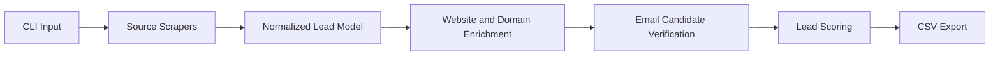

<h1 align="center">
  <span style="color:#7BAFD4;">ProspectIQ</span>
</h1>

<p align="center">
  
</p>

<p align="center">
  <a href="https://www.python.org/downloads/"></a>
  <a href="LICENSE"></a>
  <a href="https://github.com/davishiggins/prospectiq/actions/workflows/ci.yml"></a>
  <a href="https://github.com/astral-sh/ruff"></a>
  <a href="CHANGELOG.md"></a>
  
</p>

<p align="center">
  <em>Open-source lead intelligence, profile enrichment, and contact-data export from a unified Python CLI.</em>
</p>

---

## Overview

ProspectIQ collects publicly available profile information from eight sources, folds
those very different shapes into one lead schema, and tries to work out how to
contact the person behind the profile.

Concretely, it:

- collects publicly available profile information from supported sources
- normalizes that information into a single record shape, regardless of source
- extracts contact details already published in bios and profile fields
- enriches records by analysing the lead's website and resolving their company domain
- infers likely email addresses from a company's observed address format
- verifies email candidates at the SMTP layer where the mail server permits it
- calculates a transparent, additive lead-quality score
- exports a structured CSV with a stable column order

**On accuracy:** ProspectIQ does not guarantee that any email it returns is correct or
deliverable. Addresses found in a bio are facts; addresses derived from a company's
naming pattern are educated guesses. Every record carries an `email_source` and an
`email_confidence`, and `email_verified` is set only when a mail server explicitly
confirmed that specific mailbox. Treat unverified addresses as leads, not as truth.

Try it without configuring anything:

```bash
prospectiq --demo
```

## Why ProspectIQ

Most contact-enrichment tooling is a paid API with an opaque confidence number. You
send a name and a domain, you get an address back, and you have no idea whether the
service observed it, inferred it, or guessed it.

ProspectIQ is the opposite trade-off:

| | ProspectIQ | Typical enrichment SaaS |
|---|---|---|
| **Cost** | Free, MIT licensed | Per-credit or per-seat |
| **Where data comes from** | Recorded per record in `email_source` | Usually undisclosed |
| **Scoring** | Additive, documented, auditable in `scoring.py` | Proprietary |
| **Where the data lives** | Local CSV on your machine | Vendor's cloud |
| **Extending it** | Add a module and one registry entry | File a feature request |

It is also intentionally a *modest* tool. It does not solve CAPTCHAs, evade blocks,
or send mail. See [Responsible Use](#responsible-use).

## Key Features

- **Eight sources** behind one interface, all returning the same lead shape
- **A normalized lead model** — source-specific fields are preserved as extra CSV
  columns rather than being dropped
- **Website deep-scraping** across `/`, `/contact`, and `/about` for contact details
- **Company domain resolution** from a stated employer, via DNS MX lookup
- **Email pattern inference** — observing `bob.smith@acme.com` reveals the house
  style, which locates a colleague's address
- **SMTP verification** with catch-all detection, so a domain that accepts everything
  is not mistaken for confirmation
- **Transparent lead scoring**, 0–100, every point traceable to a named signal
- **CSV export** with a documented, stable schema and formula-injection protection
- **Offline demo mode** — the full pipeline on fictional data, no credentials
- **Conservative defaults** — 2–5s delays, per-source pacing, opt-in update checks
- **Typed errors** — rate limits, auth failures, and blocks are distinguishable

## Architecture



Each stage is a separate package, and each depends only on the stage before it:

```
prospectiq/
├── cli.py              # argument parsing and dispatch
├── interactive.py      # menu-driven mode
├── config.py           # all environment reading happens here, and nowhere else
├── constants.py        # branding, pacing defaults, schema, blacklists
├── logging_config.py   # one handler, installed by the CLI only
├── branding.py         # terminal palette, banner, NO_COLOR handling
├── demo.py             # offline demo pipeline
├── updates.py          # opt-in, advisory release check
├── models/
│   └── lead.py         # the Lead schema and from_raw() normalization
├── scrapers/
│   ├── base.py         # shared HTTP layer; maps status codes to typed errors
│   ├── registry.py     # declarative source table + collect()
│   └── <source>.py     # one module per source
├── enrichment/
│   ├── enricher.py     # pipeline orchestration
│   ├── email_patterns.py
│   ├── smtp_verify.py
│   └── scoring.py
├── exporters/
│   └── csv_exporter.py
└── utilities/
    ├── text.py         # email/phone/number extraction
    ├── net.py          # user agents, proxies, pacing, retries
    └── errors.py       # the exception hierarchy
```

Two design decisions carry most of the weight:

**`Lead.from_raw()` is the normalization boundary.** Scrapers return whatever their
source provides. `from_raw` maps aliases (`full_name`→`display_name`,
`subscriber_count`→`follower_count`), coerces types so a string count cannot corrupt
scoring, and routes unmodelled fields into `extra` instead of discarding them.
Everything downstream sees one shape.

**`scrapers/registry.py` is the only place sources are enumerated.** The CLI, the
interactive menu, and `prospectiq sources` all read from it, so adding a source means
adding a module and one table entry.

## Supported Sources

| Source | Auth | Collected fields | Known limitations |
|---|---|---|---|
| **Instagram** | None | name, bio, followers, following, posts, website, email, phone, verified, business/private flags | Public profiles only; may throttle by region or IP; login walls are skipped, not bypassed |
| **TikTok** | None | name, bio, followers, following, likes, videos, email, verified | Frequently serves challenge pages to datacenter IPs |
| **LinkedIn** | Your own `li_at` cookie | name, headline, summary, website, email, premium/influencer flags | Requires a session cookie you export yourself; cookies expire; only shows what your account can already see |
| **GitHub** | None | name, bio, company, location, website, email, followers, repos, Twitter handle | Public REST API, 60 req/hour unauthenticated |
| **YouTube** | None | channel name, description, subscribers, channel ID, outbound links, business email | Occasionally serves a consent interstitial; one retry is attempted |
| **Twitch** | None | name, bio, followers, partner/affiliate status, social links | Public GraphQL endpoint; rejects many datacenter proxies |
| **Pinterest** | None | name, bio, followers, following, pins, boards, website, merchant verification | Public profiles only |
| **Link-in-bio** | None | name, bio, all outbound links, detected socials, website, `mailto:` addresses | Covers Linktree, Stan, Linkr, Bio.link; generic parser for the latter three |

Run `prospectiq sources` to see this list with live availability.

## Installation

Requires **Python 3.10+**.

```bash
git clone https://github.com/davishiggins/prospectiq.git
cd prospectiq
python -m venv .venv
source .venv/bin/activate        # Windows: .venv\Scripts\activate
pip install -e .
cp .env.example .env             # optional; every setting is optional
```

Optional extras:

```bash
pip install -e ".[dev]"          # tests, ruff, mypy, pre-commit
pip install -e ".[proxy]"        # free-proxy support
```

`requirements.txt` installs this project, so it and `pip install .` cannot drift apart.

## Quick Start

```bash
# See the whole pipeline on fictional data — no credentials, no network
prospectiq --demo

# Collect two GitHub profiles and export
prospectiq collect --source github --username torvalds --username gvanrossum

# Collect from a file, skip enrichment
prospectiq collect --source instagram --input handles.txt --no-enrich

# Launch the interactive menu
prospectiq
```

## CLI Commands

```
prospectiq                        Interactive menu
prospectiq --demo                 Offline demo with fictional data
prospectiq --version              Print version
prospectiq --help                 Print help

prospectiq collect                Collect from a source
  -s, --source SOURCE             instagram | tiktok | linkedin | github
                                  youtube | twitch | linkbio | pinterest
  -u, --username NAME             Username to collect; repeatable
  -i, --input FILE                Read usernames from .txt or .csv
  -o, --output DIR                Export directory
      --no-enrich                 Skip the enrichment stage
      --no-export                 Print results without writing a CSV

prospectiq sources                List sources and their availability
prospectiq exports                List previous CSV exports
prospectiq doctor                 Check configuration and connectivity
prospectiq demo                   Same as --demo

Global flags:
  -v, --verbose                   Debug logging
      --no-color                  Disable colored output
```

`python -m prospectiq` works identically to the `prospectiq` command.

## Configuration

Every setting is optional — ProspectIQ runs with none of them. Configure via `.env`
or environment variables. See [.env.example](.env.example) for the annotated list.

| Variable | Default | Purpose |
|---|---|---|
| `PROSPECTIQ_LINKEDIN_COOKIE` | — | Your own `li_at` session cookie |
| `PROSPECTIQ_HUNTER_API_KEY` | — | Optional Hunter.io key for extra coverage |
| `PROSPECTIQ_DELAY_MIN` | `2.0` | Minimum delay between requests, seconds |
| `PROSPECTIQ_DELAY_MAX` | `5.0` | Maximum delay between requests, seconds |
| `PROSPECTIQ_PROXY` | — | Single proxy URL |
| `PROSPECTIQ_PROXY_FILE` | — | File of proxies, one per line, rotated |
| `PROSPECTIQ_FREE_PROXY` | `false` | Use free public proxies (unreliable) |
| `PROSPECTIQ_OUTPUT_DIR` | `exports` | Where CSVs are written |
| `PROSPECTIQ_SMTP_VERIFY` | `true` | Attempt SMTP existence checks |
| `PROSPECTIQ_UPDATE_CHECK` | `false` | Check for new releases on startup |
| `NO_COLOR` | — | Standard opt-out; disables colored output |

Delays have an enforced floor of 0.5s, and an inverted range is corrected rather than
honoured. When you have not set a delay, per-source defaults apply — LinkedIn waits
4–8s, GitHub 1–2s.

**Migrating from Scout:** the `SCOUT_`-prefixed spellings of `PROXY`, `PROXY_FILE`,
`FREE_PROXY`, `DELAY_MIN`, and `DELAY_MAX` are still read as a deprecated fallback.
They print a non-blocking warning and will be removed in a future release.

### LinkedIn setup

LinkedIn is the only source needing authentication, and it uses *your own* session —
ProspectIQ never asks for, stores, or transmits a password.

1. Log into LinkedIn in your browser
2. DevTools (F12) → Application → Cookies → `linkedin.com`
3. Copy the value of `li_at`
4. Add `PROSPECTIQ_LINKEDIN_COOKIE=<value>` to `.env`

Treat that cookie like a password. It is gitignored; logging out invalidates it.

## Example Workflow

```bash
$ prospectiq collect --source github --username octocat --username defunkt

GitHub  2 to collect
────────────────────────────────────────────────────────
  ✓ The Octocat  18,000 followers (1/2)
  ✓ Chris Wanstrath  22,000 followers (2/2)

  · Collected 2/2 profiles.

Enrichment  2 leads
────────────────────────────────────────────────────────
  · (1/2) octocat → octocat@github.com
  · (2/2) defunkt → chris@github.com

  · Found 1 new emails and 0 new phone numbers. Average lead score: 55/100.

  ✓ Exported 2 leads to exports/prospectiq_leads_github_20260724_143022.csv
```

What happened between those two stages: each profile's website was fetched along with
its `/contact` and `/about` pages, the stated employer was resolved to a domain via
MX lookup, addresses observed on that domain revealed the house style, a candidate was
inferred for anyone without a published address, each candidate was SMTP-checked where
the server allowed it, and the strongest candidate won on score.

## Output Schema

CSV files start with these columns, always in this order:

| Column | Type | Description |
|---|---|---|
| `source` | string | Which source the record came from |
| `username` | string | Handle on that source |
| `display_name` | string | Human-readable name |
| `profile_url` | string | Canonical public profile URL |
| `biography` | string | Bio or description text |
| `website` | string | Best external URL found |
| `email` | string | Highest-confidence email candidate |
| `email_confidence` | int | 0–100 confidence in that address |
| `email_source` | string | `bio`, `website`, `bio_link`, `pattern`, `smtp_guess`, `hunter.io` |
| `email_verified` | bool | True **only** when SMTP confirmed that mailbox |
| `phone` | string | Phone number found on the profile or linked pages |
| `company` | string | Employer name, when stated |
| `company_domain` | string | Domain resolved for that employer |
| `headline` | string | Professional headline, where the source has one |
| `location` | string | Self-reported location |
| `follower_count` | int | Followers or subscribers |
| `following_count` | int | Accounts followed |
| `is_verified` | bool | Whether the source marks the account verified |
| `lead_score` | int | 0–100 quality score |
| `collected_at` | string | UTC ISO-8601 collection timestamp |

Source-specific fields follow, sorted alphabetically — `public_repos` for GitHub,
`is_partner` for Twitch, `social_instagram` for link-in-bio pages, and so on. A field
one source provides appears as an empty cell for the others, so a mixed export is
still a single well-formed table.

Text beginning with `=`, `+`, `-`, or `@` is prefixed with an apostrophe on export.
Scraped bios are untrusted input, and spreadsheets execute such cells as formulas.

## Lead Scoring

`lead_score` answers "how actionable is this record?" — not "how likely is this person
to buy". It is additive and capped at 100, and lives in
[`enrichment/scoring.py`](prospectiq/enrichment/scoring.py).

| Signal | Points |
|---|---|
| Email found | +30 |
| Phone found | +30 |
| Website present | +10 |
| Account verified on source | +10 |
| Company or company domain known | +5 |
| Followers 5k–50k | +15 |
| Followers 1k–100k (outside the band above) | +10 |
| Any followers at all | +5 |
| Buyer-intent keyword in bio or headline | +5 |

Mid-sized accounts score highest deliberately: large enough to be an established
business, small enough that someone still reads their own inbox.

## Email Enrichment Process

1. **Bio extraction** — addresses and phone numbers the person published themselves.
   The strongest signal available, scored 90.
2. **Website deep-scrape** — `/`, `/contact`, `/contact-us`, `/about`, `/about-us`.
   Personal addresses are preferred over role mailboxes like `info@`. Scored 70.
3. **Company domain resolution** — an employer parsed from `company` or a
   "Role at Company" headline, resolved by trying `.com`/`.io`/`.co` and keeping
   whichever publishes MX records.
4. **Pattern inference** — addresses observed on the company domain reveal the house
   style, which is then applied to the lead's name. Scored 40, plus up to 15 more when
   several addresses corroborate the pattern.
5. **SMTP probing** — a last resort when nothing else was found. Capped at four
   candidates and stops at the first confirmation. Scored 70.
6. **Hunter.io** — only when you supply an API key. Scored 80.
7. **Selection** — every unique candidate is scored, and the highest wins.

Verification issues `RCPT TO` and disconnects; **no mail is ever sent**. It is
inherently unreliable — many servers accept every recipient, greylist unknown senders,
or block verification traffic. So:

- a catch-all domain is detected by probing an address that cannot exist, and its
  acceptance costs 20 confidence points rather than being trusted
- `email_verified=false` means **unconfirmed**, never "invalid"
- set `PROSPECTIQ_SMTP_VERIFY=false` to skip all SMTP traffic

## Responsible Use

ProspectIQ collects **publicly available information only**. It is a research and
prospecting tool, and using it makes you the data controller for everything you export.

**You are responsible for:**

- complying with applicable law, including GDPR, CCPA, CAN-SPAM, and PECR
- respecting the terms of service of every platform you collect from
- respecting rate limits and not degrading the services you query
- collecting only information you are authorized to access
- not using exported data for spam, harassment, or deceptive outreach
- protecting exported personal data — it is personal data the moment it lands on disk
- honouring deletion and opt-out requests promptly
- establishing a lawful basis before contacting anyone, where your jurisdiction
  requires one

**What ProspectIQ deliberately does not do:**

| Not implemented | Why |
|---|---|
| CAPTCHA solving or bypass | A challenge is a "no". It is reported, not defeated. |
| Stealth or fingerprint evasion | Rotating ordinary user agents is not the same as impersonating a real browser session. |
| Credential collection | LinkedIn uses a cookie *you* export. No password is ever requested. |
| Account takeover behaviour | It reads only what your own session can already see. |
| Automated mass messaging | ProspectIQ finds contact details. Sending is your problem, and your responsibility. |
| Private or paywalled data | Login walls and 403s cause a skip, not a workaround. |

**Technical guardrails:** 2–5s default delays with per-source tuning, an enforced 0.5s
floor, rate limits that stop the run for that source rather than retrying, opt-in
update checks so no unrequested outbound request is made, and a `.gitignore` covering
`.env`, cookies, proxy lists, logs, and every generated CSV.

If you are collecting data on people in the EU or UK, read Article 14 GDPR before you
run this. It applies to data you obtained from somewhere other than the data subject.

## Testing

```bash
pytest                    # full suite
pytest --cov=prospectiq   # with coverage
pytest -m "not network"   # skip network-marked tests (CI default)
```

The suite is hermetic. HTTP is mocked, SMTP is hard-blocked by an autouse fixture that
fails any test opening a real connection, environment variables are stripped before
each test, and all writes go to `tmp_path`. No test needs LinkedIn cookies, API keys,
proxies, SMTP access, or live sources.

Covered: configuration loading and the deprecated `SCOUT_` fallback, email and phone
extraction, lead and email scoring, CSV export and schema stability, formula-injection
protection, cross-source normalization, scraper status-code mapping, error typing,
demo mode, and the CLI.

## Development

```bash
pip install -e ".[dev]"
pre-commit install

ruff check .              # lint
ruff format --check .     # formatting
mypy prospectiq           # type checking
pytest                    # tests
```

CI runs on Python 3.10, 3.11, and 3.12: install, lint, format check, type check,
tests, and a CLI smoke test.

**Adding a source:**

1. Create `prospectiq/scrapers/<source>.py` with
   `fetch(identifier: str, config: Config) -> dict | None`
2. Use `fetch_html()` from `base.py` so status codes map to typed errors
3. Return a raw dict — `Lead.from_raw()` handles the schema
4. Add one `Source(...)` entry to `registry.py`
5. Add tests with mocked HTTP

Nothing else needs to change: the CLI, the menu, and `prospectiq sources` all read
from the registry.

## Roadmap

See [ROADMAP.md](ROADMAP.md). Near-term: JSON and JSONL exporters, a resumable
collection state file, per-source structured rate-limit backoff, and an opt-in
deduplication pass across exports.

## Contributing

Contributions are welcome — see [CONTRIBUTING.md](CONTRIBUTING.md) for setup, style,
and PR expectations, and [CODE_OF_CONDUCT.md](CODE_OF_CONDUCT.md).

Please note the scope boundary: pull requests implementing CAPTCHA bypass, stealth
fingerprinting, credential harvesting, or mass-messaging automation will be declined
regardless of code quality.

Security issues: see [SECURITY.md](SECURITY.md). Please do not open a public issue.

## License

MIT — see [LICENSE](LICENSE).

ProspectIQ is a rebranded and substantially modified derivative of the MIT licensed
[Scout](https://github.com/kiryano/Scout) project. See [ATTRIBUTION.md](ATTRIBUTION.md)
for what was inherited and what was rewritten.

## Maintainer

**Davis Higgins**  
Data Science student, Data Analyst, and Web Developer

- Portfolio: https://davishiggins.com
- Higgins Digital: https://higginsd.com
- GitHub: https://github.com/davishiggins
