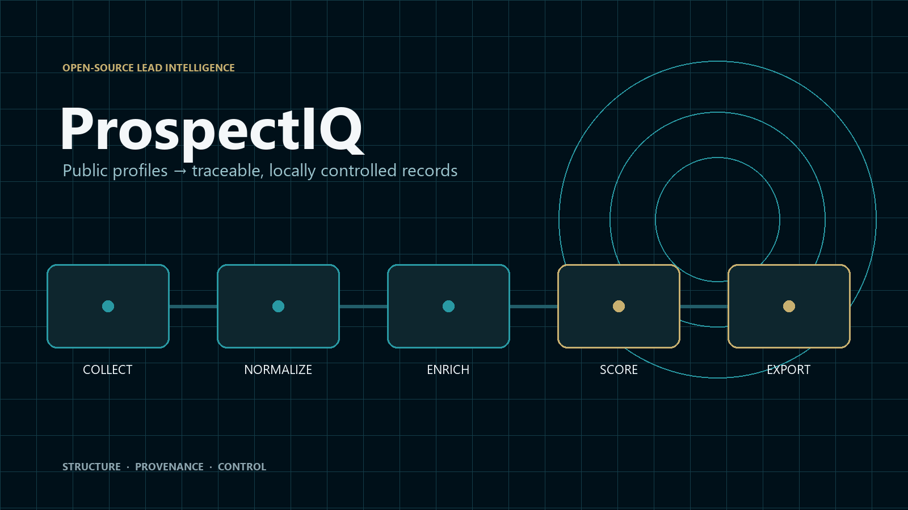
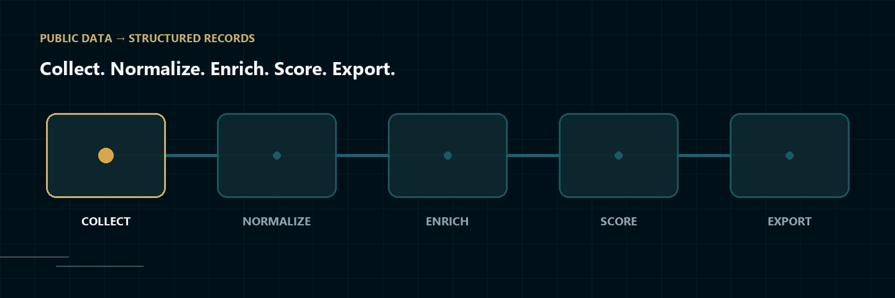
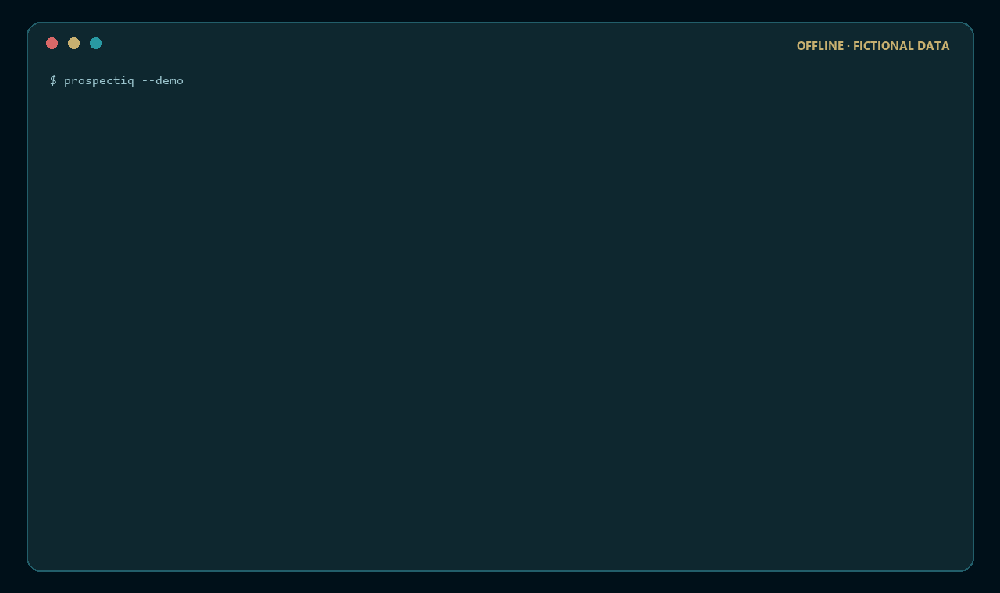
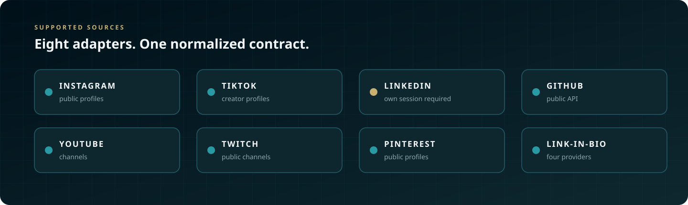
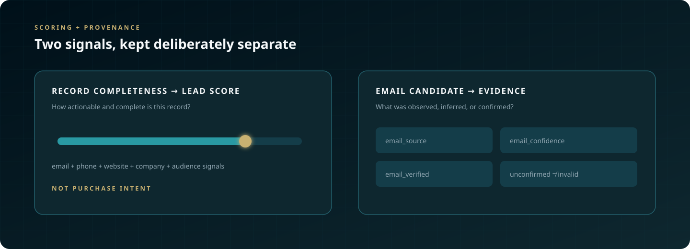
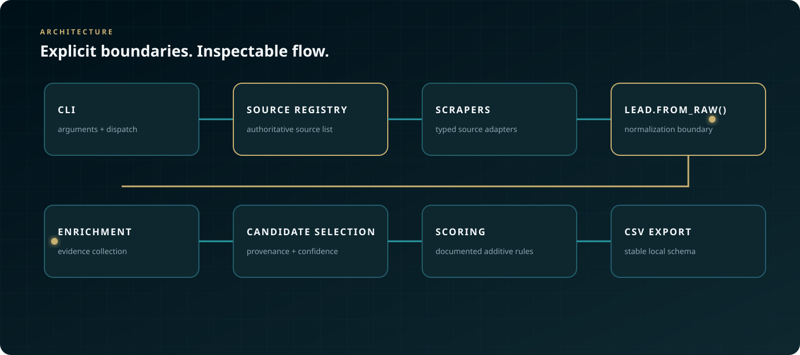

<p align="center">
  
</p>

<h1 align="center">ProspectIQ</h1>

<p align="center">
  <strong>Open-source lead intelligence for turning fragmented public-profile data into structured, traceable, locally controlled records.</strong>
</p>

<p align="center">
  Collect → Normalize → Enrich → Score → Export
</p>

<p align="center">
  <a href="https://github.com/DavisHiggins/ProspectIQ/actions/workflows/ci.yml"></a>
  <a href="https://www.python.org/downloads/"></a>
  <a href="LICENSE"></a>
  <a href="CHANGELOG.md"></a>
  <a href="pyproject.toml"></a>
  <a href="https://github.com/astral-sh/ruff"></a>
</p>

<p align="center">
  <a href="#start-in-60-seconds">Quick Start</a>
  ·
  <a href="#see-prospectiq-run">Demo</a>
  ·
  <a href="#how-it-works">How It Works</a>
  ·
  <a href="#supported-sources">Sources</a>
  ·
  <a href="#architecture">Architecture</a>
  ·
  <a href="#responsible-use">Responsible Use</a>
</p>

## Start in 60 Seconds

New here? Run the offline demo first. It is the fastest way to understand
ProspectIQ without configuring a source.

```bash
git clone https://github.com/DavisHiggins/ProspectIQ.git
cd ProspectIQ
python -m venv .venv
```

<details open>
<summary><strong>macOS / Linux</strong></summary>

```bash
source .venv/bin/activate
python -m pip install -e .
prospectiq --demo
```

</details>

<details>
<summary><strong>Windows PowerShell</strong></summary>

```powershell
.venv\Scripts\Activate.ps1
python -m pip install -e .
prospectiq --demo
```

</details>

`prospectiq --demo` uses fictional records and reserved `example.com` domains.
It needs no credentials and makes no live network requests. It exercises the
real normalization, scoring, and CSV export code with deterministic offline
enrichment outcomes.

> [!IMPORTANT]
> ProspectIQ works with publicly available information. You remain responsible
> for lawful collection, platform terms, secure handling, deletion requests,
> and compliant outreach.

### Navigate this guide

**Get started:** [Quick Start](#start-in-60-seconds) · [Demo](#see-prospectiq-run) · [Sources](#supported-sources)<br>
**How it works:** [Pipeline](#how-it-works) · [Enrichment](#how-enrichment-works) · [Scoring](#scoring-and-provenance) · [Architecture](#architecture)<br>
**Reference:** [Output](#output-schema) · [CLI](#cli-reference) · [Configuration](#configuration)<br>
**Project:** [Responsible Use](#responsible-use) · [Quality](#testing-and-engineering-quality) · [Roadmap](#roadmap) · [Contributing](#contributing)

## Why ProspectIQ

ProspectIQ is an open-source Python lead-intelligence pipeline built around
transparency.

It collects publicly available profile information from supported sources,
normalizes source-specific fields into one consistent lead model, enriches
records using published websites and company-domain signals, evaluates record
actionability with documented rules, and exports a stable CSV locally.

The goal is not to hide the process behind an opaque score. ProspectIQ keeps
provenance visible so you can distinguish what was observed, what was inferred,
and what remains unverified.

> [!NOTE]
> `lead_score` measures record completeness and actionability. It is not a
> prediction of purchase intent.

| Principle | What ProspectIQ does |
|---|---|
| **Transparency** | Records the selected email's source, confidence, and SMTP confirmation state. |
| **Local control** | Writes CSV exports to your machine instead of a hosted vendor database. |
| **Inspectable scoring** | Calculates an additive score from named signals in [`scoring.py`](prospectiq/enrichment/scoring.py). |
| **Extensibility** | Adds a source with one scraper module and one authoritative registry entry. |
| **Responsible scope** | Does not bypass CAPTCHAs, access private data, or send mass outreach. |

## How It Works

<p align="center">
  <picture>
    <source
      media="(prefers-reduced-motion: reduce)"
      srcset="docs/assets/prospectiq-pipeline.svg"
    />
    
  </picture>
</p>

The pipeline collects one source-specific record, normalizes it through
`Lead.from_raw()`, adds contact evidence when configured, calculates documented
scores, and writes a stable local CSV. Enrichment is failure-tolerant: an
unreachable website or unavailable SMTP server degrades evidence rather than
discarding a successfully collected lead.

### Core capabilities

| Collect | Normalize |
|---|---|
| Eight registry-backed sources | One typed `Lead` model |
| Conservative per-source pacing | Alias mapping and type coercion |
| Typed auth, block, not-found, and rate-limit failures | Source-specific extras preserved |
| Public-profile scope | One downstream record shape |

| Enrich | Score and export |
|---|---|
| Published bio and website contacts | Transparent additive `lead_score` |
| Company-domain resolution | Email provenance and confidence |
| Pattern inference and optional SMTP checks | Stable CSV schema |
| Optional Hunter.io lookup | Formula-injection protection |

## See ProspectIQ Run

This animation comes from a real `prospectiq --demo` run against the project's
fictional offline dataset. The local absolute path and variable timestamp are
shortened in the capture; the records and command output are not invented.

<p align="center">
  
</p>

```bash
prospectiq --demo
```

The demo writes a sample CSV to `demo_output/`. Real collection replaces its
fictional source records and deterministic enrichment outcomes with configured
HTTP, DNS, and optional SMTP operations.

## Supported Sources

<p align="center">
  
</p>

The source names describe compatible public endpoints, not partnerships or
endorsements. Run `prospectiq sources` to see current local availability.

<details>
<summary><strong>View source capabilities and limitations</strong></summary>

| Source | Auth | Best for | Primary fields | Limitations |
|---|---|---|---|---|
| **Instagram** | None | Public creator and business profiles | name, bio, followers, following, posts, website, published email/phone, profile flags | Public profiles only; login walls are skipped; may throttle by region or IP |
| **TikTok** | None | Public creator profiles | name, bio, followers, following, likes, videos, published email, verified state | May serve challenge pages to some regions or IPs |
| **LinkedIn** | Your own `li_at` cookie | Public professional profile data visible to your session | name, headline, summary, website, published email, verification and profile flags | Cookie expires; only accesses what your own session can already view |
| **GitHub** | None | Public developer profiles | name, bio, company, location, website, email, followers, repositories, social handle | Public API is limited to 60 requests per hour when unauthenticated |
| **YouTube** | None | Public channels | channel name, description, subscribers, channel ID, outbound links, published business email | May serve consent interstitials; one retry is attempted |
| **Twitch** | None | Public channels | name, bio, followers, published email, partner/affiliate state, social links | Public GraphQL endpoint can reject datacenter proxies |
| **Pinterest** | None | Public profiles | name, bio, followers, following, pins, boards, website, merchant verification | Public profiles only |
| **Link-in-bio** | None | Linktree, Stan, Linkr, and Bio.link pages | name, bio, outbound links, detected socials, website, `mailto:` addresses | Provider markup changes can limit extraction |

</details>

## How Enrichment Works

ProspectIQ does not treat every discovered email equally. Candidate source,
corroboration, verification behavior, and provenance determine which address is
selected.

1. **Bio extraction** reads emails and phone numbers the person published in
   their source profile.
2. **Website deep-scrape** checks the published site plus `/contact`,
   `/contact-us`, `/about`, and `/about-us`. Personal mailboxes outrank generic
   role addresses.
3. **Company-domain resolution** derives candidates from a stated employer or
   a conventional `Role at Company` headline, then retains domains with MX
   records.
4. **Published bio links** are checked, up to three per lead, for contact
   evidence.
5. **Pattern inference** applies an observed company email convention to a
   lead's normalized first and last name. It runs only when same-domain evidence
   exists.
6. **Optional SMTP probing and Hunter.io** add evidence when enabled. SMTP
   guessing is a last resort, capped at four candidates; Hunter.io runs only
   with an operator-supplied API key.
7. **Candidate selection** deduplicates candidates, applies the documented
   confidence rules, and keeps the strongest address with its provenance.

SMTP checks issue `RCPT TO` and disconnect. No message is sent. Many mail
servers accept every recipient, greylist unknown senders, or block probes, so
SMTP confirmation does not guarantee deliverability. `email_verified=false`
means **unconfirmed**, never invalid.

## Scoring and Provenance

<p align="center">
  
</p>

> `lead_score` measures how complete and actionable a record is. It does not
> predict whether a person will buy.

The score is additive, capped at 100, and calculated in
[`prospectiq/enrichment/scoring.py`](prospectiq/enrichment/scoring.py).

| Record signal | Points |
|---|---:|
| Email found | +30 |
| Phone found | +30 |
| Website present | +10 |
| Account marked verified by the source | +10 |
| Company or company domain known | +5 |
| Followers from 5,000 through 50,000 | +15 |
| Followers from 1,000 through 100,000, outside the band above | +10 |
| Any other positive follower count | +5 |
| Documented business-role keyword in bio or headline | +5 |

Email evidence remains separate from the record score:

| Field | Meaning |
|---|---|
| `email` | Highest-confidence unique candidate selected for the record |
| `email_source` | Where the candidate came from, such as `bio`, `website`, `pattern`, or `hunter.io` |
| `email_confidence` | Additive 0–100 evidence score for that address |
| `email_verified` | `true` only when SMTP accepted that mailbox and the domain was not catch-all |

<details>
<summary><strong>View email confidence rules</strong></summary>

| Evidence | Base score |
|---|---:|
| Published in bio | 90 |
| Hunter.io result | 80 |
| Published on website | 70 |
| SMTP-confirmed generated candidate | 70 |
| Published on a bio link | 65 |
| Contact-page candidate | 60 |
| Inferred from company pattern | 40 |

- SMTP confirmation adds 10 points.
- Catch-all behavior subtracts 20 points.
- Pattern corroboration adds 10 points for one or two observed addresses and
  15 points for three or more.
- Every confidence score is clamped to 0–100.

An **observed** address appeared in published source material. An **inferred**
address was constructed from company-domain pattern evidence. A **verified**
address received a positive, non-catch-all SMTP response. An **unconfirmed**
address may still be valid; the server simply did not prove it.

</details>

## Architecture

<p align="center">
  
</p>

| Design boundary | Why it matters |
|---|---|
| **`Lead.from_raw()` is the normalization boundary** | Scrapers can return source-shaped dictionaries while enrichment, scoring, and export always receive one typed record. Aliases are mapped, numeric fields are coerced, and unknown fields move into `extra`. |
| **`scrapers/registry.py` is the authoritative source registry** | The CLI, interactive menu, availability output, and collector use the same source table. A new source requires one module and one registry entry. |

<details>
<summary><strong>View package layout</strong></summary>

```text
prospectiq/
├── cli.py                  # argument parsing and dispatch
├── interactive.py          # menu-driven mode
├── config.py               # centralized environment loading
├── constants.py            # identity, palette, pacing, schema, blacklists
├── branding.py             # terminal theme and NO_COLOR behavior
├── demo.py                 # offline fictional-data demo
├── models/
│   └── lead.py             # Lead schema and from_raw() normalization
├── scrapers/
│   ├── base.py             # shared HTTP and typed status handling
│   ├── registry.py         # authoritative source registry
│   └── <source>.py         # one adapter per source
├── enrichment/
│   ├── enricher.py         # enrichment orchestration
│   ├── email_patterns.py   # pattern evidence and candidates
│   ├── smtp_verify.py      # optional SMTP checks
│   └── scoring.py          # additive record/email scoring
├── exporters/
│   └── csv_exporter.py     # stable, sanitized CSV output
└── utilities/
    ├── text.py             # contact and number extraction
    ├── net.py              # pacing, retries, proxies, user agents
    └── errors.py           # typed failure hierarchy
```

</details>

## Output Schema

Every CSV begins with the same 20 core columns. Source-specific fields are
appended alphabetically without changing the unified core schema.

```text
source · username · display_name · profile_url · biography · website
email · email_confidence · email_source · email_verified · phone
company · company_domain · headline · location · follower_count
following_count · is_verified · lead_score · collected_at
```

<details>
<summary><strong>View the full CSV schema</strong></summary>

| Column | Type | Description |
|---|---|---|
| `source` | string | Source key for the record |
| `username` | string | Handle on that source |
| `display_name` | string | Human-readable name |
| `profile_url` | string | Canonical public profile URL |
| `biography` | string | Bio or description text |
| `website` | string | Best external URL found |
| `email` | string | Highest-confidence email candidate |
| `email_confidence` | integer | 0–100 evidence score for the candidate |
| `email_source` | string | Candidate provenance |
| `email_verified` | boolean | Positive, non-catch-all SMTP confirmation only |
| `phone` | string | Phone number from a profile or linked page |
| `company` | string | Stated employer, when available |
| `company_domain` | string | Employer domain resolved through MX lookup |
| `headline` | string | Professional headline, where available |
| `location` | string | Self-reported location |
| `follower_count` | integer | Followers or subscribers |
| `following_count` | integer | Accounts followed |
| `is_verified` | boolean | Source-provided verification state |
| `lead_score` | integer | Transparent 0–100 record-actionability score |
| `collected_at` | string | UTC ISO-8601 collection timestamp |

Examples of appended fields include `public_repos` for GitHub, `is_partner`
for Twitch, and `social_instagram` for a link-in-bio page. A mixed-source export
uses the union of extra fields and leaves unavailable cells empty.

</details>

Exported text beginning with `=`, `+`, `-`, `@`, a tab, or a carriage return is
prefixed with an apostrophe to prevent spreadsheet formula injection.

## CLI Reference

`python -m prospectiq` and the installed `prospectiq` command use the same
entry point.

<details open>
<summary><code>prospectiq collect</code> <strong>Collection</strong></summary>

```text
prospectiq collect -s SOURCE [-u NAME ...] [-i FILE] [-o DIR]
                   [--no-enrich] [--no-export]
```

| Option | Meaning |
|---|---|
| `-s`, `--source` | Required source key from `prospectiq sources` |
| `-u`, `--username` | Username or identifier; repeatable |
| `-i`, `--input` | Read identifiers from a `.txt` or `.csv` file |
| `-o`, `--output` | Override the export directory |
| `--no-enrich` | Keep normalized source data without enrichment |
| `--no-export` | Print results without writing CSV |

```bash
prospectiq collect --source github --username octocat --no-export
prospectiq collect --source instagram --input handles.txt --no-enrich
```

</details>

<details>
<summary><strong>Sources, exports, demo, and doctor</strong></summary>

| Command | Behavior |
|---|---|
| `prospectiq sources` | List registry entries, auth requirements, availability, and limitations |
| `prospectiq exports` | List the newest CSV exports from the configured output directory |
| `prospectiq demo` | Run the same offline demo as `prospectiq --demo` |
| `prospectiq doctor` | Report configuration state and perform an outbound connectivity check |
| `prospectiq` | Open the interactive menu |

</details>

<details>
<summary><strong>Global flags</strong></summary>

| Flag | Behavior |
|---|---|
| `--demo` | Run the offline fictional-data demo |
| `--version` | Print the installed ProspectIQ version |
| `-v`, `--verbose` | Enable debug logging |
| `--no-color` | Disable colored terminal output |
| `-h`, `--help` | Show command help |

</details>

## Configuration

### Most users need nothing

Demo mode and every source except LinkedIn work without credentials. Copying
`.env.example` is optional; ProspectIQ also reads environment variables directly.

<details open>
<summary><strong>Optional authentication and enrichment</strong></summary>

| Variable | Default | Purpose |
|---|---|---|
| `PROSPECTIQ_LINKEDIN_COOKIE` | unset | Your own exported `li_at` session cookie |
| `PROSPECTIQ_HUNTER_API_KEY` | unset | Optional Hunter.io email-finder coverage |

The unprefixed vendor spellings `LINKEDIN_COOKIE` and `HUNTER_API_KEY` are also
accepted when their `PROSPECTIQ_` equivalents are absent.

> [!WARNING]
> A LinkedIn cookie grants access to your account. Treat it like a password,
> never paste it into logs or issues, and invalidate it by logging out if it is
> exposed. ProspectIQ uses only the session you supply and does not request a
> password.

</details>

<details>
<summary><strong>Network behavior</strong></summary>

| Variable | Default | Purpose |
|---|---|---|
| `PROSPECTIQ_DELAY_MIN` | `2.0` | Global minimum delay in seconds |
| `PROSPECTIQ_DELAY_MAX` | `5.0` | Global maximum delay in seconds |
| `PROSPECTIQ_PROXY` | unset | One proxy URL |
| `PROSPECTIQ_PROXY_FILE` | unset | Newline-delimited proxy list |
| `PROSPECTIQ_FREE_PROXY` | `false` | Use unreliable public proxies |

Delays have an enforced 0.5-second floor. When no global delay is configured,
per-source defaults apply, including 4–8 seconds for LinkedIn and 1–2 seconds
for GitHub.

</details>

<details>
<summary><strong>Output and behavior</strong></summary>

| Variable | Default | Purpose |
|---|---|---|
| `PROSPECTIQ_OUTPUT_DIR` | `exports` | Local CSV destination |
| `PROSPECTIQ_SMTP_VERIFY` | `true` | Attempt SMTP existence checks |
| `PROSPECTIQ_UPDATE_CHECK` | `false` | Opt in to the GitHub release check |
| `NO_COLOR` | unset | Disable ANSI color when set |

</details>

<details>
<summary><strong>Deprecated Scout aliases</strong></summary>

`SCOUT_PROXY`, `SCOUT_PROXY_FILE`, `SCOUT_FREE_PROXY`, `SCOUT_DELAY_MIN`, and
`SCOUT_DELAY_MAX` remain non-blocking migration fallbacks. Their
`PROSPECTIQ_` equivalents take precedence, and use of a fallback emits a
deprecation warning.

</details>

## Responsible Use

ProspectIQ collects publicly available information only. Running it can make
you the data controller for exported personal information.

| You are responsible for | ProspectIQ deliberately does not do |
|---|---|
| Applicable privacy, data-protection, and outreach law | CAPTCHA solving or challenge bypass |
| Platform terms and rate limits | Stealth fingerprint evasion |
| Authorized access and lawful basis | Credential harvesting or account takeover |
| Secure storage and retention limits | Private or paywalled data access |
| Access, deletion, and opt-out requests | Automated mass-message sending |
| Accurate, lawful, non-deceptive outreach | Treat blocks or login walls as obstacles to defeat |

Built-in guardrails include conservative pacing, per-source delay defaults, an
enforced delay floor, rate limits that stop collection for that source, opt-in
update checks, typed network errors, credential-safe output, and spreadsheet
formula neutralization.

If you collect data about people in the EU or UK, understand your transparency
and notice obligations, including Article 14 GDPR, before running the tool.
See [SECURITY.md](SECURITY.md) for credential handling and data-protection
guidance.

## Testing and Engineering Quality

The suite is designed to remain hermetic: HTTP is mocked, SMTP is hard-blocked
by an autouse fixture, environment variables are isolated, and file writes use
temporary directories. CI validates Linux on Python 3.10, 3.11, and 3.12 plus
Windows on Python 3.12.

```bash
python -m pip install -e ".[dev]"
pytest
ruff check .
ruff format --check .
mypy prospectiq
```

Coverage includes configuration and legacy fallbacks, cross-source
normalization, scraper status mapping, typed errors, enrichment helpers, SMTP
states, scoring, schema stability, formula-injection protection, CLI behavior,
and the offline demo. CI also builds and checks the source distribution and
wheel, then installs the wheel in a clean environment for CLI smoke tests.

## Extending ProspectIQ

1. Create `prospectiq/scrapers/<source>.py` with
   `fetch(identifier: str, config: Config) -> dict[str, Any] | None`.
2. Use `fetch_html()` from `scrapers/base.py` so status codes map to typed
   errors consistently.
3. Return source-shaped public data. `Lead.from_raw()` owns normalization.
4. Add one `Source(...)` entry to `scrapers/registry.py` with honest limits.
5. Add conservative pacing to `SOURCE_DELAYS`.
6. Add offline tests for success, not-found, and at least one failure mode.
7. Update the source table above.

See [CONTRIBUTING.md](CONTRIBUTING.md) for the full contribution contract.

## Roadmap

See [ROADMAP.md](ROADMAP.md) for planned work and explicit non-goals. Near-term
items include JSON/JSONL export, resumable collection state, structured
rate-limit backoff, and opt-in cross-export deduplication. A roadmap item is not
a current capability.

## Contributing

Contributions are welcome. Start with [CONTRIBUTING.md](CONTRIBUTING.md), follow
the [Code of Conduct](CODE_OF_CONDUCT.md), and keep tests offline. Pull requests
for CAPTCHA bypass, stealth fingerprinting, credential harvesting, private-data
access, or mass-messaging automation are outside project scope.

## Security

Report vulnerabilities privately through
[GitHub Security Advisories](https://github.com/DavisHiggins/ProspectIQ/security/advisories/new).
Do not open a public issue and never include real cookies, keys, proxy
credentials, or third-party personal data. See [SECURITY.md](SECURITY.md).

## Attribution

ProspectIQ is a substantially re-architected and independently maintained
derivative of the MIT-licensed Scout project. See
[ATTRIBUTION.md](ATTRIBUTION.md) for inherited functionality, rewritten
components, and third-party dependency licenses.

## License

ProspectIQ is available under the [MIT License](LICENSE).

## Maintainer

**Davis Higgins**

- [Portfolio](https://davishiggins.com)
- [Higgins Digital](https://www.higginsd.com/)
- [GitHub](https://github.com/DavisHiggins)

<p align="center">
  <sub>Built for traceability, transformation, structure, provenance, clarity, and control.</sub>
</p>
